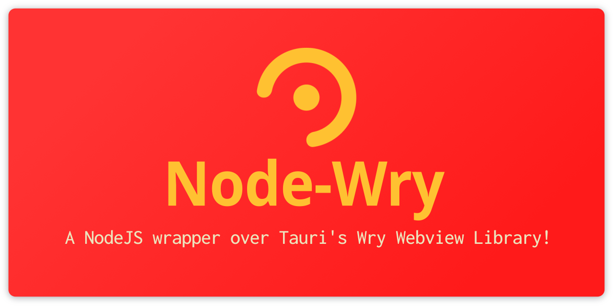

<br />
<p align="center">
  <a href="#"> <!-- Change the HREF to the link! -->
    
  </a>

  <p align="center">
    A NodeJS wrapper over Tauri's Wry Webview library!
    <br />
    <a href="https://github.com/tauri-apps/wry"><strong><em>Powered by Wry</em></strong></a>
	<br />
	Status: <em>0.1.0 - Still in Rapid Dev</em>
    Unofficial
	<br />
    <a href="https://nodei.co/npm/node-wry/"></a>
    <br />
    <!-- SHIELDS -->
    <a href="https://shields.io"></a>
  </p>
</p>

## Quick Start

<span style="background:yellow;color:black;">*Show a really quick and easy way to implement the package into a project!*</span>

```console
$ npm install node-wry
```

<span style="background:yellow;color:black;">*Provide any visual output, either as a codebox, or an image/gif!*</span>

## Table of Contents

<span style="background:yellow;color:black;">*If small readme, delete this?*</span>

- [Quick Start](#quick-start)
- [Motivation](#motivation)
- [Installation](#installation)
- [Usage](#usage)
- [API Reference](#api-reference)
- [Contributing](#contributing)
- [Roadmap](#roadmap)
- [The Bottom Stuff](#the-bottom-stuff)

## Motivation

Why did you need to make this project and not use one that was already available?

## Installation

How do you install this thing?

## Usage

Show how to use the actual damn thing!

## API Reference

Put any useful API info here, in case I `require` it instead.

## Contributing

How can the average everyday Joe help make this project better? Maybe there's a [TODO](./TODO.md) list with things that need attention?

## Roadmap

See the [issues page](/issues) for all known issues.

You can also take a peak at the [MoSCoW targets](./TODO.md)

## The Bottom Stuff

Author: TheBrenny <iam+dev@justbrenny.me> © 2020 // [See License.md](./license.md)

- [I'm a Dev](https://justbrenny.me/dev)
- [I'm a DJ](https://justbrenny.me/dj)
- [I'm OS](https://github.com/TheBrenny/)

License: [Not yet licensed](https://choosealicense.com/)